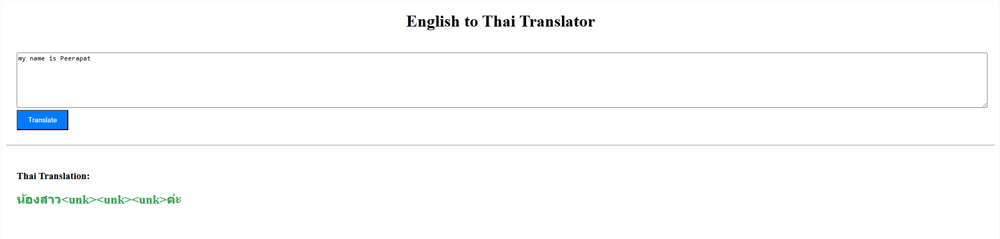

# English-Thai Neural Machine Translation with Attention

This project implements a Sequence-to-Sequence (Seq2Seq) network with Attention mechanisms to translate text from English to Thai. It explores and compares two different attention scoring methods: **General Attention** and **Additive Attention**.

The project includes a Jupyter Notebook for training the models and a **Dash** web application for interactive translation.

## 📂 Project Structure

* **`train.ipynb`**: The main notebook used for data loading, preprocessing, training the Seq2Seq models, and evaluating performance.
* **`main.py`**: A web-based user interface built with Dash. It loads the trained models and vocabularies to perform real-time translation.
* **`data_eng.txt` / `data_tha.txt`**: The parallel corpus datasets used for training.

### 📑 Dataset Source
The English–Thai parallel corpus was obtained from the **TALPCo (Thai-English Parallel Corpus)** project:

- https://github.com/matbahasa/TALPCo/blob/master/eng/data_eng.txt

## 🛠️ Requirements

To run this project, you need Python installed along with the following libraries:

```bash
pip install torch torchtext spacy pythainlp dash matplotlib seaborn
```

## ▶️ Run the Application

After installing all dependencies, run the application with:

```bash
python main.py
```

## 🌐 Example Website

Below is an example of the web application interface:




## 📊 Training Results

The performance comparison between attention mechanisms is shown below:

| Attentions | Training Loss | Training PPL | Validation Loss | Validation PPL |
| :--- | :--- | :--- | :--- | :--- |
| General Attention | 2.790 | 16.284 | 4.765 | 117.284 |
| Additive Attention | 1.491 | 4.441 | 4.325 | 75.558 |
